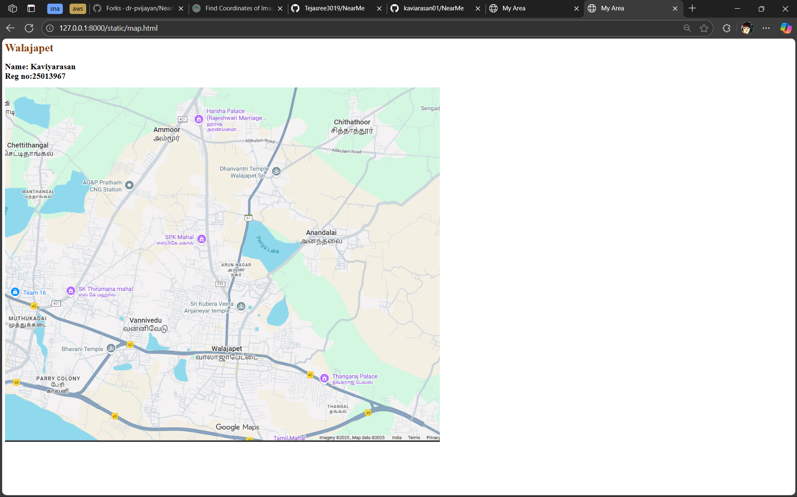
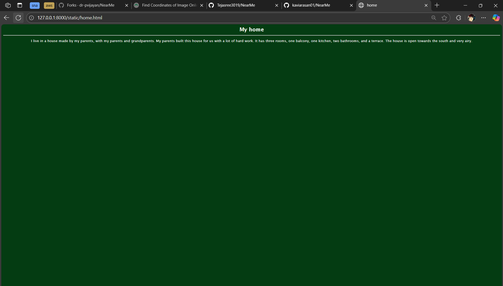
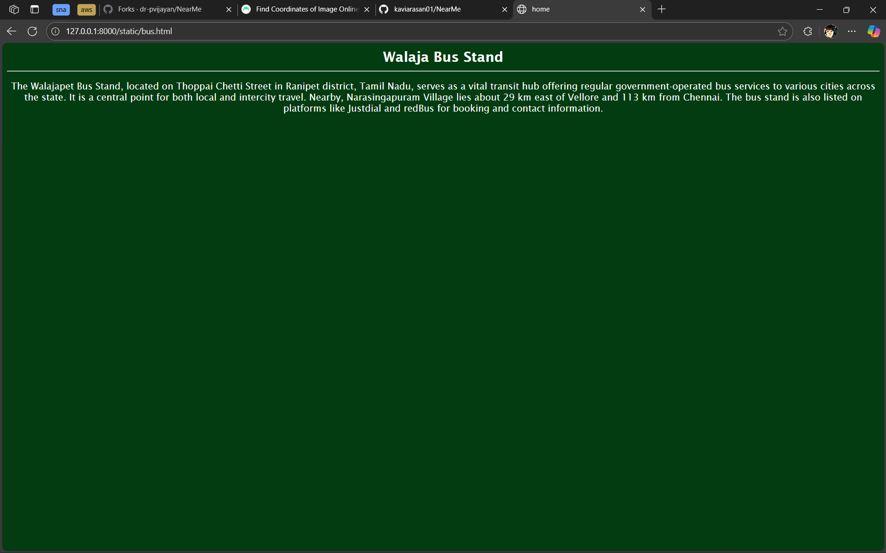
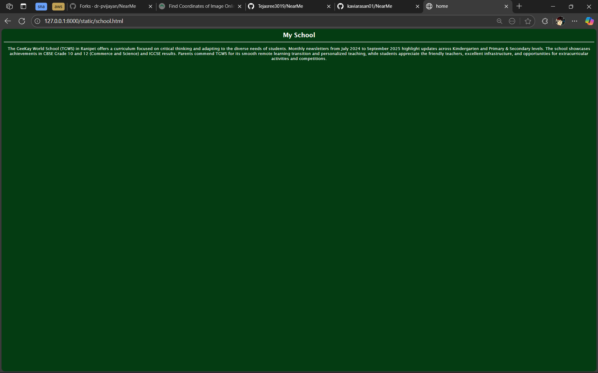
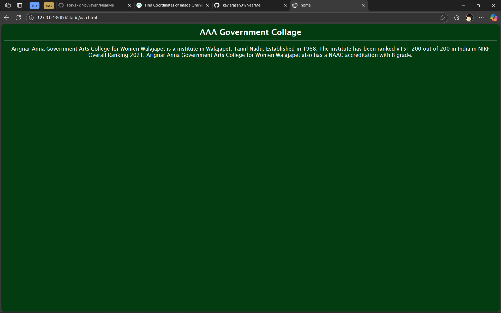

# Ex03 Places Around Me

## Date: 31-10-2025

## AIM

To develop a website to display details about the places around my house.

## DESIGN STEPS

### STEP 1

Create a Django admin interface.

### STEP 2

Download your city map from Google as an image.

### STEP 3

Insert the image using `` tag and link it to the map.

### STEP 4

Using `<map>` tag name the map.

### STEP 5

Create clickable regions in the image using `<area>` tag.

### STEP 6

Write HTML programs for all the regions identified.

### STEP 7

Execute the programs and publish them.

## CODE

map.html

```html
<html>
  <head>
    <meta charset="utf-8" />
    <title>My Area</title>
  </head>

  <body>
    <h1 style="color: saddlebrown; align-content: center;">Walajapet</h1>
    <h2>
      Name: Kaviyarasan <br />
      Reg no:25013967
    </h2>

    
    <map name="MyCity">
      <area shape="circle" coords="795,810,6" href="home.html" title="home" />
      <area
        shape="rect"
        coords="839,759,769,737"
        alt="Ractangle"
        href="aaa.html"
        title="AAA gov clg"
      />
      <area
        shape="rect"
        coords="339,78,362,91"
        title="Ractangle"
        href="school.html"
        title="my school"
      />
      <area
        shape="circle"
        coords="648,752,12"
        title="Circle"
        href="bus.html"
        title="Bus stand"
      />
    </map>
  </body>
</html>
```

aaa.html

```html
<html>
  <head>
    <meta charset="utf-8" />
    <title>home</title>
    <style>
      body {
        background-color: rgb(4, 60, 18);
        color: white;
        font-family: "Lucida Sans", "Lucida Sans Regular", "Lucida Grande",
          "Lucida Sans Unicode", Geneva, Verdana, sans-serif;
        text-align: center;
      }
      h2 {
        margin: 10px;
      }
      hr {
        color: white;
      }
    </style>
  </head>
  <body>
    <h2>AAA Government Collage</h2>
    <hr />
    <p>
      Arignar Anna Government Arts College for Women Walajapet is a institute in
      Walajapet, Tamil Nadu. Established in 1968, The institute has been ranked
      #151-200 out of 200 in India in NIRF Overall Ranking 2021. Arignar Anna
      Government Arts College for Women Walajapet also has a NAAC accreditation
      with B grade.
    </p>
  </body>
</html>
```

school.html

```html
<html>
  <head>
    <meta charset="utf-8" />
    <title>home</title>
    <style>
      body {
        background-color: rgb(4, 60, 18);
        color: white;
        font-family: "Lucida Sans", "Lucida Sans Regular", "Lucida Grande",
          "Lucida Sans Unicode", Geneva, Verdana, sans-serif;
        text-align: center;
      }
      h2 {
        margin: 10px;
      }
      hr {
        color: white;
      }
    </style>
  </head>
  <body>
    <h2>My School</h2>
    <hr />
    <p>
      The GeeKay World School (TGWS) in Ranipet offers a curriculum focused on
      critical thinking and adapting to the diverse needs of students. Monthly
      newsletters from July 2024 to September 2025 highlight updates across
      Kindergarten and Primary & Secondary levels. The school showcases
      achievements in CBSE Grade 10 and 12 (Commerce and Science) and IGCSE
      results. Parents commend TGWS for its smooth remote learning transition
      and personalized teaching, while students appreciate the friendly
      teachers, excellent infrastructure, and opportunities for extracurricular
      activities and competitions.
    </p>
  </body>
</html>
```

home.html

```html
<html>
  <head>
    <meta charset="utf-8" />
    <title>home</title>
    <style>
      body {
        background-color: rgb(4, 60, 18);
        color: white;
        font-family: "Lucida Sans", "Lucida Sans Regular", "Lucida Grande",
          "Lucida Sans Unicode", Geneva, Verdana, sans-serif;
        text-align: center;
      }
      h2 {
        margin: 10px;
      }
      hr {
        color: white;
      }
    </style>
  </head>
  <body>
    <h2>My home</h2>
    <hr />
    <p>
      I live in a house made by my parents, with my parents and grandparents. My
      parents built this house for us with a lot of hard work. It has three
      rooms, one balcony, one kitchen, two bathrooms, and a terrace. The house
      is open towards the south and very airy.
    </p>
  </body>
</html>
```

bus.html

```html
<html>
  <head>
    <meta charset="utf-8" />
    <title>home</title>
    <style>
      body {
        background-color: rgb(4, 60, 18);
        color: white;
        font-family: "Lucida Sans", "Lucida Sans Regular", "Lucida Grande",
          "Lucida Sans Unicode", Geneva, Verdana, sans-serif;
        text-align: center;
      }
      h2 {
        margin: 10px;
      }
      hr {
        color: white;
      }
    </style>
  </head>
  <body>
    <h2>Walaja Bus Stand</h2>
    <hr />
    <p>
      The Walajapet Bus Stand, located on Thoppai Chetti Street in Ranipet
      district, Tamil Nadu, serves as a vital transit hub offering regular
      government-operated bus services to various cities across the state. It is
      a central point for both local and intercity travel. Nearby,
      Narasingapuram Village lies about 29 km east of Vellore and 113 km from
      Chennai. The bus stand is also listed on platforms like Justdial and
      redBus for booking and contact information.
    </p>
  </body>
</html>
```

## OUTPUT










## RESULT

The program for implementing image maps using HTML is executed successfully.
